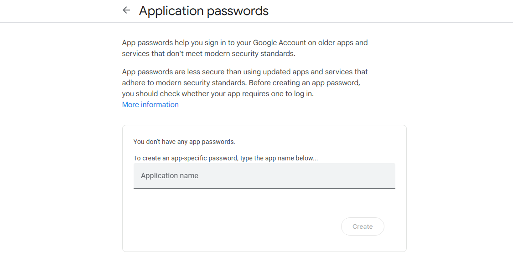
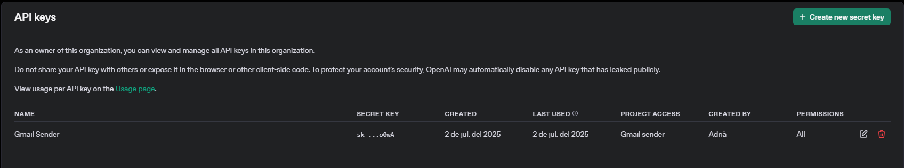

# AI GMAIL SENDER

#### Description:
Using the _OpenAI API_ and the library _yagmail_ we are able to send AI generated emails to the person we want to write in just a few seconds. No more wasting time thinking on how to properly write an email to your teachers or colleagues. The text will be generated in the language that the prompt is given.

## Getting Started
### Prerequisites
You should install the libraries used in this program by typing the following commands in your command line:
```
pip install yagmail
pip install openai
pip install dotenv
 ```
Additionally, the libraries _os_, _re_ and _sys_ will also be used
***
### Installation
#### Step 1
Register or log in with your Google account at [Google App Passwords](https://myaccount.google.com/apppasswords). Then, create a new app and save the key for later.

> [!CAUTION]
> This key is personal. Do not share this key with anyone.



#### Step 2
Register or log in with your OpenAI account at [OpenAI API Platform](https://platform.openai.com/docs/overview). Then, you will be requested to create a project. Once created, go to _API Keys_ and create a new secret key. Copy this key and save it for later.

> [!WARNING]
> The usage of OpenAI API spends tokens, for which you will have to pay. In order to use this program, you will have to add a payment method in the OpenAI API Platform.

#### Step 3
Create an _.env_ file, where your will paste the keys obtained before and your gmail address:
```
OPENAI_API_KEY=<your OpenAI key>
GMAIL_KEY=<your Google App key>
GMAIL_ADDRESS=example@gmail.com
```

## Usage
To run this program, type the following command in your terminal window:
```
python main.py
```
First of all, you will need to enter the email address of the recipient. This address will be checked using a regular expression.
```
pattern = r"^[a-zA-Z0-9._%+-]+@[a-zA-Z0-9.-]+\.[a-zA-Z]{2,}$"
    match = re.search(pattern, s)
    if match:
        return s
    else:
        sys.exit('Not a valid email address')
```
If it is valid, you will be asked for a prompt, in which you will describe the content of the email. In case the address is not valid, the program will be finished via _sys.exit_, showing the following message in the terminal:
```
Not a valid email address
```
### Os / Dotenv
Your keys and address will be loaded with the following line of code:
```
load_dotenv()
```

Then, you will be able to access your keys and address with the following code:
```
os.getenv('OPENAI_API_KEY')
os.getenv('GMAIL_KEY')
os.getenv('GMAIL_ADDRESS')
```

### OpenAI API
The elaboration of the text will be done by the OpenAI API. It will also generate the subject of the email.
```
client = OpenAI(api_key=os.getenv('OPENAI_API_KEY'))
body = client.responses.create(
    model="gpt-4o-mini", # You can use different OpenAI engine models.
    instructions="You are an assistant", # Give the model an instruction for the output
    temperature=0.5, # From 0 to 2. 0 for rigid answers, 2 for more creative answers.
    input=prompt
)
```
You can check all the available engine models and their pricing at [OpenAI API Models](https://platform.openai.com/docs/pricing)
> [!TIP]
> I recommend to use gpt-4o-mini engine model, as it is a cheap but powerful version.

### Yagmail
Finally, the _yagmail_ library is used. Here you must pass your Gmail address and your  Google App key saved in your _tokens.py_ file. The recipient will instantly recieve the email in the inbox.
```
yag = yagmail.SMTP(gmail_address, gmail_token)
yag.send(to=recipient, subject=subj, contents=content)
```
If done correctly, the following message will be shown in your terminal window.
```
The email has been sent correctly✅
```
Otherwise, an error message will pop up in your terminal window. If this is the case, check carefully that you followed the instructions given in this document step by step. Also, make sure that you have enough OpenAI API tokens.
```
Error occurred❌
```

## Documentation
For more information on the libraries used in this program, you can check the following documentation.
* [Yagmail](https://yagmail.readthedocs.io/en/latest/)
* [OpenAI API](https://platform.openai.com/docs/guides/text?api-mode=responses)
* [Dotenv](https://pypi.org/project/python-dotenv/)
